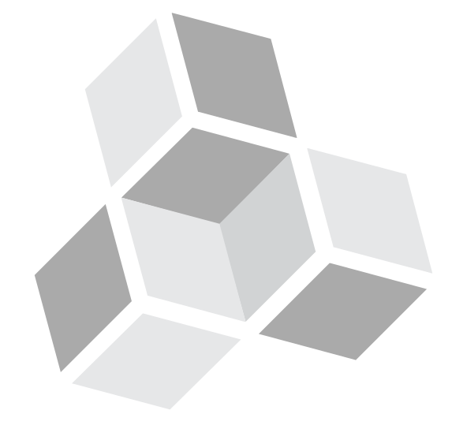
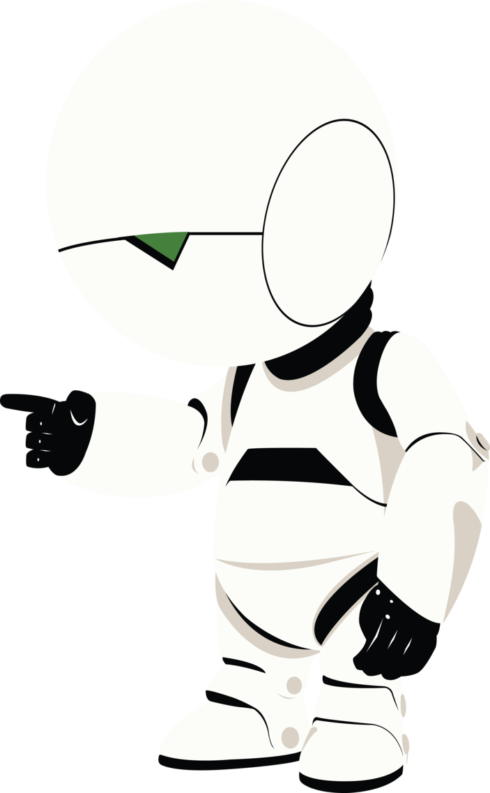

title: Meet Mysam
output: index.html
theme: theme
controls: false
logo: theme/logo.png

-- intro

# Meet mySam

--

## HTML5 can hear you!

```javascript
// Only works in recent Webkit Browsers like
// Mobile Android, Chrome, Chromium
var recognition = new webkitSpeechRecognition();
recognition.onresult = function(event) {
  console.log(event)
}
recognition.start();
```

#### Try it at [jsbin.com/sivuri](http://jsbin.com/sivuri)

--

## Machine learning (AI)

> Label each dataset.

> Then turn it into a fixed length list of numbers between 0 and 1.

```javascript
const brain = require('brain.js');
const net = new brain.NeuralNetwork();

// [ R, G, B ]
net.train([
  { input: [ 0.03, 0.7, 0.5 ], output: { black: 1 } },
  { input: [ 0.16, 0.09, 0.2 ], output: { white: 1 } },
  { input: [ 0.5, 0.5, 1.0 ], output: { white: 1 }
});

var output = net.run([1, 0.4, 0 ]);  // { white: 0.99, black: 0.002 }
```

--

# Natural Language Processing (NLP)

--

## \#1 Tokenize

```javascript
tokenize('What is the meaning of life')
// -> [ 'What', 'is', 'the', 'meaning', 'of', 'life' ]
tokenize('What is the weather like today')
// -> [ 'What', 'is', 'the', 'weather', 'like', 'today' ]
```

--

## \#2 Stem

```javascript
stem([ 'What', 'is', 'the', 'meaning', 'of', 'life' ])
// -> ['what', 'mean', 'life']
stem([ 'What', 'is', 'the', 'weather', 'like', 'today' ])
// -> [ 'what', 'weather', 'todai' ]

join(['what', 'mean', 'life'], [ 'what', 'weather', 'todai' ])
// -> [ 'what', 'mean', 'life', 'weather', 'todai' ]
```

--

## \#3 Featurize


```javascript
// [ 'what', 'mean', 'life', 'weather', 'todai' ]
features([ 'what', 'weather', 'todai' ])
// -> [ 1, 0, 0, 1, 1 ]
features([ 'what', 'mean', 'life' ])
// -> [ 1, 1, 1, 0, 0 ]
```

--

## \#4 Train

```javascript
var net = new brain.NeuralNetwork();

// [ 'what', 'mean', 'life', 'weather', 'todai' ]
net.train([
  // [ 'what', 'weather', 'todai' ]
  { input: [ 1, 0, 0, 1, 1 ], output: { sunshine: 1 } },
  // [ 'what', 'mean', 'life' ]
  { input: [ 1, 1, 1, 0, 0 ], output: { fourtytwo: 1 } }
]);
```

--

## \#5 Classify

```javascript
tokenizeAndStem('Can you tell me about the weather today please')
// -> [ 'can', 'tell', 'weather', 'todai', 'pleas' ]
features([ 'can', 'tell', 'weather', 'todai', 'pleas' ])
// [ 'what', 'mean', 'life', 'weather', 'todai' ]
// -> [ 0, 0, 0, 1, 1 ]
net.run([ 0, 0, 0, 1, 1 ]);
// -> { sunshine: 0.9326151115201983, fourtytwo: 0.06951084324415624 }
```

--

## natural-brain

A [node-natural](https://github.com/NaturalNode/natural) classifier using a [brain.js](https://github.com/harthur-org/brain.js) neural network:

```javascript
const classifier = new require('natural-brain').BrainJSClassifier();

classifier.addDocument('my unit-tests failed.', 'software');
classifier.addDocument('tried the program, but it was buggy.', 'software');
classifier.addDocument('tomorrow we will do standup.', 'meeting');
classifier.addDocument('can you play some new music?', 'music');

classifier.train();

console.log(classifier.classify('did the tests pass?')); // -> software
console.log(classifier.classify('Lets meet tomorrow?')); // -> meeting
console.log(classifier.classify('Can you play some stuff?')); // -> music
```
--

## Writing plugins: Server

```javascript
export default function() {
  const app = this;

  // Get a database backed service at the /todos endpoint
  const todoService = app.service('/todos');

  // Create a custom Feathers service
  app.use('/tweet', {
    create(data) {
      return twitterClient.sendTweet(data.content);
    }
  });
}
```

--

## Writing plugins: Client

```javascript
export default function({ React, $ /* ... */ }) {
  const app = this;

  app.learn('myplugin', {
    description: 'Do something cool',
    tags: [ 'content' ],
    form(classification) {},
    onSubmit(form) {}
  });

  app.action('myplugin', function(el, classification) {
    // Make API calls and show content here
  });
}
```

-- centered

## The tech

<a href="https://github.com/NaturalNode/natural">node-natural</a>&nbsp;&raquo;
<a href="https://github.com/mysamai/natural-brain" target="_blank">natural-brain</a>&nbsp;&raquo;
<a href="https://github.com/harthur-org/brain.js" target="_blank">brain.js</a>

<a href="http://feathersjs.com" target="_blank"></a>

<a href="http://electron.atom.io/" target="_blank"></a>
<a href="https://facebook.github.io/react/" target="_blank"></a>
<a href="http://stealjs.com" target="_blank"></a>

-- marvin

<div class="quote-container">
  <h2>“Don’t pretend you want to talk to me, I know you hate me.” - <small>Marvin</small></h2>
  <p><a href="http://wheelmaker42.deviantart.com/art/Marvin-the-Paranoid-Android-499132446" target="_blank">wheelmaker42.deviantart.com</a></p>
</div>


--

# Why?

-- questions code-large

## MySam is an experiment

- Can we make Machine Learning more accessible?
- How will we relate to technology that learns?
- What is its User Experience?
- What does it mean when data becomes the technology?

-- presenter


## David Luecke

* [<i class="fa fa-github"></i> daffl](https://github.com/daffl)
* [<i class="fa fa-twitter"></i> @daffl](http://twitter.com/daffl)

[daffl.github.io/meet-mysam](http://daffl.github.io/meet-mysam)
